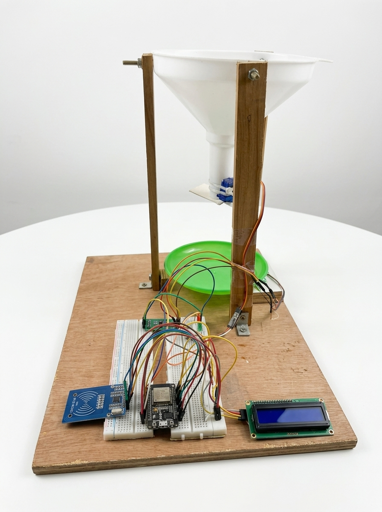
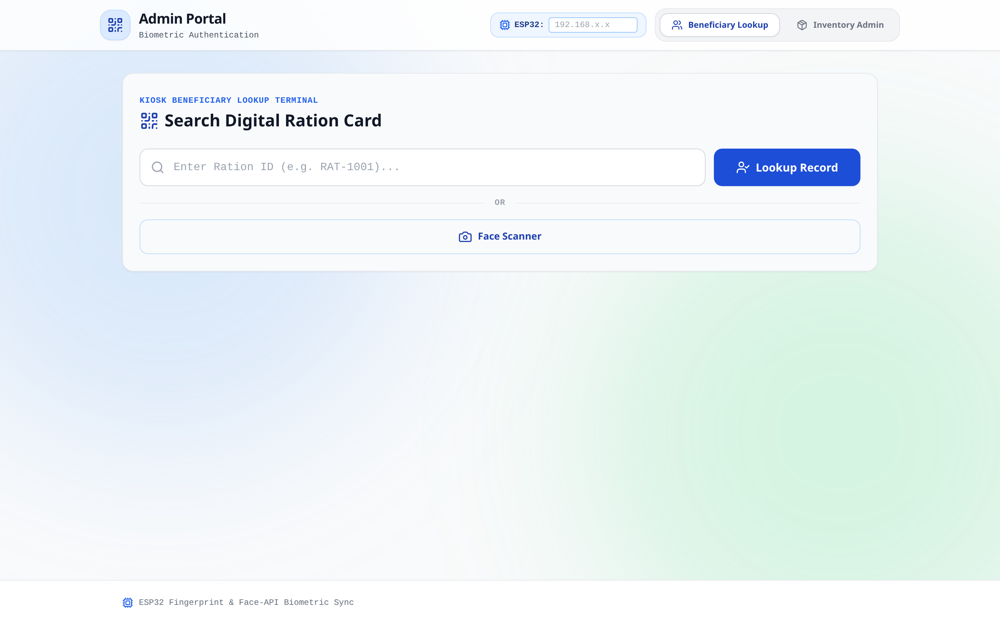
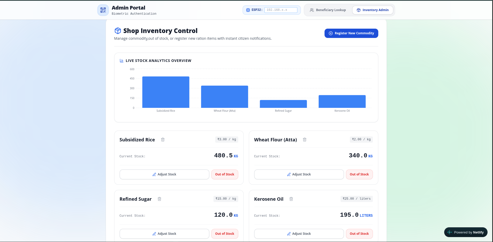

# DIGITALIZE RATION: Edge-Biometric IoT Dispensing & PDS Anti-Theft Platform

[](./LICENSE)
[](https://www.espressif.com/en/products/socs/esp32)
[](https://github.com/buildprojecthq/Shreyas_Major-Project)
[](https://supabase.com/)
[](https://majorprojectsmartration.netlify.app/)

**Digitalize Ration** is an automated, tamper-proof grain distribution platform developed to eliminate leakage, ghost cards, and weighing manipulation in the Public Distribution System (PDS). Integrating Aadhaar-linked RFID cards, client-side neural face verification, closed-loop strain gauge load cell cutoffs, and a cloud-synchronized ledger, it transforms manual ration depots into autonomous, fair-price distribution kiosks.

---

## 🌐 Live Preview

> **Try the interactive Kiosk & Admin demo — no physical hardware required.**
> 
> **[https://majorprojectsmartration.netlify.app/](https://majorprojectsmartration.netlify.app/)**
> 
> **Evaluation Instructions:**
> 1. Click **"1-Click Demo Sign In"** on the portal landing screen to instantly access the dashboard (or use the evaluation account: `admin` / `admin123`).
> 2. **Beneficiary Lookup:** Search by Ration Card ID (e.g., `RC-KA-58291`) or tap **"Scan Face to Authenticate"** using your webcam with client-side `@vladmandic/face-api`.
> 3. **Hardware Simulation:** Use the built-in **ESP32 Testing Suite** to simulate hardware scan completions and quota dispense signals without requiring physical microcontrollers.
> 4. **Inventory Admin:** Switch to the **Inventory Admin** tab to monitor live stock and commodity prices with built-in sandbox write protection.

---

## 📸 System Demonstration & Screenshots

### 1. Hardware Dispensing Unit — Bench-Tested Prototype
The physical dispensing rig features a gravity-fed hopper, an SG90 servo-actuated gate valve, and a calibrated strain gauge load cell tray interfaced via an HX711 24-bit ADC to the ESP32. User status is mirrored in real-time across an I2C 16×2 character display, dual status LEDs, and an RC522 13.56MHz RFID reader.


### 2. Administrator & Kiosk Portal — Biometric Verification & Quota Lookup
The responsive React 19 / Vite kiosk console enables ration shop operators to verify beneficiaries via dual-factor RFID or edge neural face recognition, inspect real-time commodity quotas, and issue dispense triggers.


### 3. Inventory & Distribution Telemetry — Real-Time Cloud Stock Ledger
Centralized inventory dashboard displaying commodity stock levels (Subsidized Rice, Wheat Flour, Refined Sugar, Kerosene), real-time stock deductions upon successful dispensing, price per unit controls, and distribution charts.


---

## 🏗️ System Architecture

1. **Edge Dispensing Node (ESP32):** The hardware controller. Scans RFID tokens over SPI, drives the 16×2 I2C display, samples the HX711 24-bit ADC at microsecond intervals, actuates the PWM grain gate valve, and syncs transaction records directly to Supabase over Wi-Fi.
2. **Kiosk Web Application (React 19 & Vite):** The shop management terminal. Handles client-side biometric face recognition, beneficiary quota verification, manual overrides, and local ESP32 IP bridge triggers.
3. **Citizen Mobile Application (Capacitor & React):** The beneficiary portal. Enables ration card holders to inspect monthly quotas, check live shop inventory before visiting, and track digital receipts.
4. **Cloud Ledger (Supabase / PostgreSQL):** Centralized data management layer maintaining tamper-proof transaction logs, inventory balances, and automated quota deductions.

---

## 🔌 Hardware Bill of Materials (BOM)

Digitalize Ration is engineered for high-precision grain dispensing using accessible, bench-tested hardware (~₹2,180 total BOM):

| Component | Specification | Role | Approx Rate (INR) |
| :--- | :--- | :--- | :--- |
| **Microcontroller Unit** | ESP32-WROOM-32D Dual-Core (Wi-Fi + BLE) | Master controller running firmware, load cell loop & cloud sync | ₹420 |
| **RFID Module** | RC522 13.56 MHz Reader + S50 Smart Cards | Contactless beneficiary Aadhaar/Card token authentication | ₹140 |
| **Strain Gauge Sensor** | 5kg Micro Aluminum Load Cell Bar | Precision gravimetric weight feedback for dispensed grain | ₹180 |
| **Weighing Amplifier** | HX711 24-Bit Dual-Channel ADC Module | High-resolution analog-to-digital signal amplification | ₹85 |
| **Actuator Valve** | SG90 / MG90S Metal Gear Micro Servo | Controlled 0°–90° rotary valve for grain hopper outlet | ₹120 |
| **User Interface Display** | 16×2 Character LCD with PCF8574 I2C Backpack | Real-time weight readouts, prompts & system alerts | ₹210 |
| **Status Indicators** | 5mm Diffused LEDs (Green/Red) + 220Ω Resistors | Visual access granted / denied feedback signaling | ₹25 |
| **Prototyping Platform** | 830-Point Solderless Breadboard + 40 Jumpers | Circuit wiring, decoupling bus & common ground distribution | ₹160 |
| **Mechanical Rig** | Gravity Hopper, Acrylic Stand & Weighing Tray | Material routing, mechanical stability & anti-jam guidance | ₹360 |
| **Power Delivery** | 5V 2A Regulated Adapter / USB Power Bank | Continuous power delivery with low-current trickle support | ₹480 |

*Hardware prototype guides, IEEE-format project report, and academic viva decks available on [buildproject.in](https://buildproject.in/projects/smart-ration-dispenser).*

---

## ⚡ Core Operational Features & Anti-Theft Protection

- **Dual-Factor Authentication:** Eliminates ghost beneficiaries and counterfeit physical ration cards through unique RFID UID validation combined with browser-based neural face recognition.
- **Closed-Loop Gravimetric Cutoff:** Monitors load cell readings continuously during grain flow and triggers valve shutoff at `targetWeight - cutoffOffset` (98.0g for a 100g quota), achieving ±2–3 gram accuracy without dealer intervention.
- **Real-Time Cloud Inventory Sync:** Immediately deducts distributed commodities from the central Supabase database, preventing ration shop owners from diverting uncollected quotas into the black market.
- **Offline & Standalone Operation:** Capable of running 100% autonomously from a standard USB power bank or mobile phone charger without a connected laptop (see [POWERBANK_STANDALONE_GUIDE.md](./POWERBANK_STANDALONE_GUIDE.md)).

---

## 🚀 Quick Start Guide

### 1. Kiosk Web Portal
```bash
./run_kiosk.sh
```
*Or manually:*
```bash
cd apps/kiosk-app
npm install
npm run dev
```
Open `http://localhost:5173` in your browser. Click **"1-Click Demo Sign In"** to explore.

### 2. Citizen Mobile App
```bash
./run_mobile.sh
```
*Or manually:*
```bash
cd apps/mobile-app
npm install
npm run dev
```

### 3. ESP32 Firmware & Hardware Setup
1. Connect hardware according to the verified pinout in [arduino/WIRING_AND_PINOUT.md](./arduino/WIRING_AND_PINOUT.md).
2. Open `arduino/smart_ration_dispenser/smart_ration_dispenser.ino` in Arduino IDE.
3. Configure your Wi-Fi SSID, Password, and Supabase credentials.
4. Select board **ESP32 Dev Module** and click **Upload**.
5. Calibrate the load cell using `arduino/loadcell_calibration/loadcell_calibration.ino`.

---

## 🛠️ Tech Stack

- **Frontend & Web Kiosk:** React 19, Vite, Tailwind CSS, Lucide Icons, Framer Motion, Recharts
- **Biometrics & AI:** `@vladmandic/face-api` (client-side neural facial landmark & descriptor matching)
- **Mobile Application:** React 19, Vite, Capacitor 8 (Android runtime ready)
- **Embedded Firmware:** C++ (ESP32 Arduino Core, HX711, MFRC522, ESP32Servo, LiquidCrystal_I2C)
- **Cloud Backend:** Supabase (PostgreSQL, Realtime WebSockets, REST APIs)

---

## 👥 Academic Attribution & Project Team

This project was developed at **Don Bosco Institute of Technology (DBIT), Bengaluru**, affiliated with **Visvesvaraya Technological University (VTU)**:
- **Shashikanth T R** (1DB23EC144) — Dept. of ECE
- **Shreyas S Kotyal** (1DB23EC148) — Dept. of ECE
- **Sonic M R** (1DB23EC154) — Dept. of ECE
- **Under the Guidance of:** Prof. Sharmila C, Assistant Professor & Research Coordinator, Dept. of ECE, DBIT.

---

## 📄 License

This project is licensed under the **MIT License**. See the [LICENSE](./LICENSE) file for details.

---
*Developed for transparent e-governance and automated public welfare distribution.*
